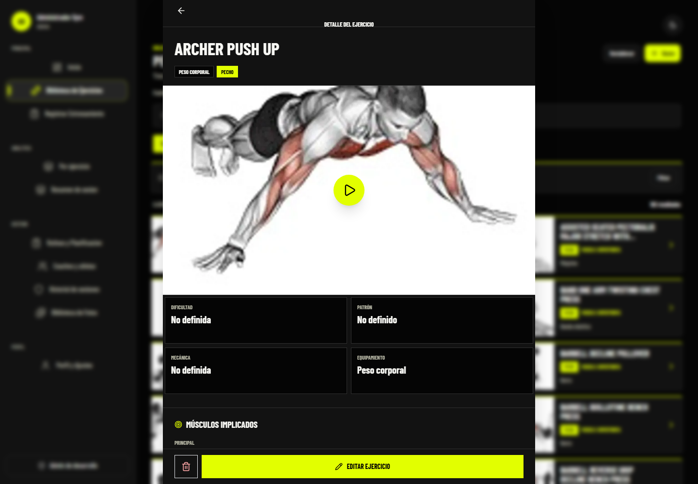
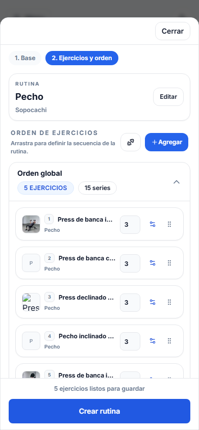

# Apex Performance - Frontend

Apex Performance is a responsive workout tracking and coaching platform built for athletes, coaches, and administrators. It combines workout planning, live session logging, exercise analytics, progress tracking, and role-based coaching workflows in a single web application.

The project was designed and developed independently as a full-stack portfolio product and has been tested by more than 10 beta users in a real gym environment.

## Live demo

- Application: [gym-frontend-t65c.onrender.com](https://gym-frontend-t65c.onrender.com/)
- API: [gym-backend-1fod.onrender.com](https://gym-backend-1fod.onrender.com/)
- Demo access: choose Athlete, Coach, or Admin from the login screen; no credentials required.

Every demo visit receives an isolated workspace with fictitious routines, plans, sessions, analytics, and weigh-ins. Account administration, shared exercise media, and catalog mutations remain protected. Demo data expires automatically according to the backend deployment configuration.

The public demo uses a separate frontend deployment. Set `VITE_PUBLIC_DEMO=true`, `VITE_API_URL` to the production API, and `VITE_MAIN_APP_URL` to the regular application. The regular deployment must keep `VITE_PUBLIC_DEMO=false`, so existing users only see login and registration.

## Product highlights

### Athlete experience

- Create routines and organize exercises, sets, repetitions, rest periods, and training days.
- Log active workouts with session recovery and mobile-friendly set controls.
- Review workout history, session summaries, exercise volume, intensity, and estimated one-repetition maximum trends.
- Track body weight, progress photos, goals, and recent achievements.
- Browse and filter a bilingual exercise catalog containing approximately 1,300 exercises.

### Coach experience

- Link athletes to a coach account through controlled assignment flows.
- Review athlete summaries, training history, and progress indicators.
- Create and assign routines, reusable plan templates, and scheduled training plans.
- Manage plan status, training cycles, rest days, and recovery days.
- Prioritize the athlete portfolio with adherence and recovery alerts.
- Generate weekly progress reports and editable assisted plan drafts.
- Review daily athlete readiness check-ins before prescribing load.
- Turn training history into an explainable daily load decision and exercise-level progression suggestions.
- Compare the active week with the same elapsed days of the previous week across sessions, volume, estimated strength, plan adherence, and recovery.
- Guide every new athlete through a resumable three-step onboarding for goal, experience, weekly frequency, weight, and height before opening the dashboard.

### Administration

Administrators can review each account's effective plan from the user directory and grant a 14-day Premium trial, activate 30 days manually, or return the account to Free. Premium screens also show an upgrade gate when the authenticated account lacks the required entitlement.

Athletes and coaches have a provider-neutral **Planes y Premium** center where they can compare the plan available for their role, start their one-time 14-day trial, and cancel Premium. Online checkout can be connected later without changing the entitlement model or user-facing flow.

- Manage users and role-based permissions for administrators, coaches, and clients.
- Curate system and custom exercises with structured classification data.
- Manage exercise media, catalog migrations, duplicate records, and AI-assisted exercise image generation.

## Exercise catalog

The catalog supports structured exercise metadata, including:

- Spanish and English names, aliases, categories, and body regions.
- Primary, secondary, and stabilizer muscles.
- Movement patterns, equipment, laterality, kinetic chain, mechanics, and force type.
- Difficulty, goals, instructions, common mistakes, and precautions.
- Images, thumbnails, animations, videos, attribution, and taxonomy versioning.

Large datasets are handled through server-side pagination, incremental loading, indexed MongoDB queries, and cached client requests.

## Frontend engineering

- Responsive layouts for desktop, Android, and iPhone browsers.
- Role-based navigation and protected application areas.
- Server-state caching, request invalidation, and infinite queries with TanStack React Query.
- Centralized API communication and error normalization with Axios.
- Reusable interface components and shared application contexts.
- Interactive charts for training volume, intensity, estimated 1RM, and muscle-group progress.
- Optimized Cloudinary images, thumbnails, and lazy-loaded media.
- Drag-and-drop exercise ordering and animated interface transitions.
- Light and dark themes with mobile-specific interaction patterns.

## Technology stack

| Area                   | Technologies                                 |
| ---------------------- | -------------------------------------------- |
| UI                     | React, JavaScript, HTML5, CSS3, Tailwind CSS |
| Build tooling          | Vite, ESLint, Prettier                       |
| Server state and API   | TanStack React Query, Axios                  |
| Data visualization     | Nivo                                         |
| Interaction and motion | dnd-kit, Framer Motion, Radix UI             |
| Media delivery         | Cloudinary                                   |
| Backend                | Node.js, Express, MongoDB, Mongoose          |
| Deployment             | Render                                       |

## Screenshots

### Exercise details



### Mobile routine workflow



## Architecture

```text
React application
  -> Axios API client
  -> Node.js and Express REST API
  -> MongoDB Atlas
  -> Cloudinary media storage
  -> OpenAI Images API for administrative image workflows
```

The frontend uses TanStack React Query for server state and React Context for authentication, current-user data, routines, and active training state.

## Local development

### Requirements

- Node.js 22 recommended.
- npm 10 or later.
- A running instance of the related backend.

### Installation

```bash
git clone https://github.com/pchuquimia/gym-frontend.git
cd gym-frontend
npm install
```

Create a local `.env` file when you need to override the default API configuration:

```env
VITE_API_URL=http://localhost:4000
VITE_CLOUDINARY_CLOUD_NAME=your-cloud-name
VITE_AUTH_TOKEN_STORAGE=localStorage
```

Start the development server:

```bash
npm run dev
```

Additional commands:

| Command                   | Purpose                                                    |
| ------------------------- | ---------------------------------------------------------- |
| `npm run build`           | Create a production build.                                 |
| `npm run lint`            | Run the ESLint checks.                                     |
| `npm run preview`         | Preview the production build locally.                      |
| `npm test`                | Run Vitest unit and React Testing Library component tests. |
| `npm run test:playwright` | Run responsive desktop and mobile browser tests.           |
| `npm run test:cypress`    | Run functional authentication tests in Cypress.            |

## Automated testing

The frontend uses complementary testing layers:

- **Vitest** validates pure UI logic such as the automatic workout flow.
- **React Testing Library** validates set inputs, read-only states, and user actions.
- **Playwright** validates responsive behavior and browser feedback on desktop and mobile.
- **Cypress** validates complete functional interactions in a real browser runner.

Playwright starts or reuses the Vite server automatically. Cypress expects the frontend server at `http://127.0.0.1:5173`; override it with `CYPRESS_BASE_URL` when necessary. On Windows, Cypress is launched through `scripts/runCypress.js`, which isolates Electron from an IDE-provided `ELECTRON_RUN_AS_NODE` variable.

## Validation

The current version has been manually validated on:

- Chrome on desktop.
- Chrome on Android.
- Safari on iPhone.
- Real gym workflows with more than 10 beta users.

Feedback from beta testing has been used to improve mobile navigation, set logging, routine creation, loading behavior, button clarity, and error handling.

## AI features in development

An advanced local development version extends the product with:

- A contextual workout assistant using authenticated user data.
- OpenAI and Anthropic model integrations.
- Function calling and structured outputs for validated routine generation.
- Retrieval-augmented generation and embeddings for semantic exercise retrieval.
- Automated progress summaries and personalized recommendations.

These features are under active development and are not yet included in the public demo or the current `main` branch.

## Roadmap

- Publish and deploy the advanced AI assistant.
- Expand automated end-to-end coverage to active workout and planning flows.
- Complete the email verification flow.
- Establish Lighthouse and Core Web Vitals performance baselines.
- Expand accessibility validation and automated quality checks.

## Related repository

- Backend API: [pchuquimia/gym-backend](https://github.com/pchuquimia/gym-backend)

## Author

**Pablo Iván Chuquimia Huanca**

- GitHub: [@pchuquimia](https://github.com/pchuquimia)
- LinkedIn: [linkedin.com/in/pchuquimia](https://www.linkedin.com/in/pchuquimia/)
